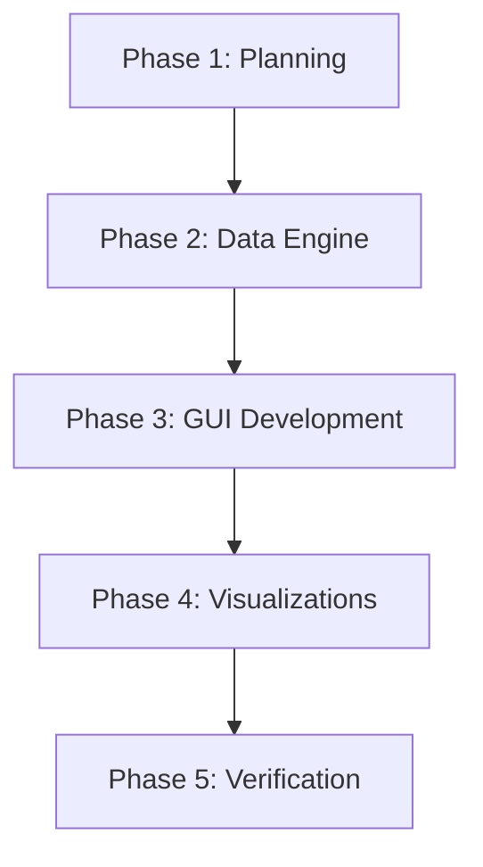

# Data Analytics: Customer and Business

A Python-based Graphical User Interface (GUI) application for analyzing customer behavior and business sales performance. Developed using Tkinter, Pandas, and Matplotlib.

## Features

- **Data Upload**: Load customer and sales data from CSV files.
- **Preprocessing**: Automatic cleaning of datasets (handling missing values, removing duplicates).
- **Business Insights**: Summary statistics including Total Sales, Top Customers, and Best-Selling Products.
- **Visualizations**:
  - **Bar Charts**: Product performance.
  - **Line Charts**: Sales trends over time.
  - **Pie Charts**: Regional sales distribution.
- **User-Friendly Interface**: Sidebar navigation for easy access to different modules.

## Project Roadmap



### Phase 1: Planning & Setup

- Requirement analysis for business KPIs.
- Selection of tech stack (Python, Tkinter, Pandas, Matplotlib).
- Environment configuration and dependency mapping.

### Phase 2: Core Data Engine

- Implementing `DataAnalyzer` class.
- Developing cleaning logic for missing values and duplicates.
- Creating data aggregation functions for sales and customer stats.

### Phase 3: GUI Development

- Designing the sidebar-based navigation system with Tkinter.
- Implementing file upload dialogs and table-view components.
- Designing a responsive content area for summaries and charts.

### Phase 4: Visualization Module

- Creating dynamic plotting functions using Matplotlib and Seaborn.
- Implementing the "Canvas" embedding logic to display charts within Tkinter.
- Adding interactive chart switching.

### Phase 5: Verification & Finalization

- Generating realistic sample data for testing.
- End-to-end verification of the data pipeline (Upload -> Clean -> Analyze -> Visualize).
- Final documentation and Git repository setup.

## Technologies Used

- **Python**: Core programming language.
- **Tkinter**: GUI development.
- **Pandas**: Data manipulation and analysis.
- **NumPy**: Numerical computing.
- **Matplotlib/Seaborn**: Data visualization.

## Setup and Installation

### 1. Prerequisites

Ensure you have Python 3.10+ installed.

### 2. Create Virtual Environment

```powershell
python -m venv venv
.\venv\Scripts\Activate.ps1
```

### 3. Install Dependencies

```powershell
pip install -r requirements.txt
```

### 4. Run the Application

```powershell
python main.py
```

## Dataset

You can generate a sample dataset for testing by running:

```powershell
python generate_sample_data.py
```

This will create `customer_sales_data.csv`.

## Author

Academic Project Submission - 2026
